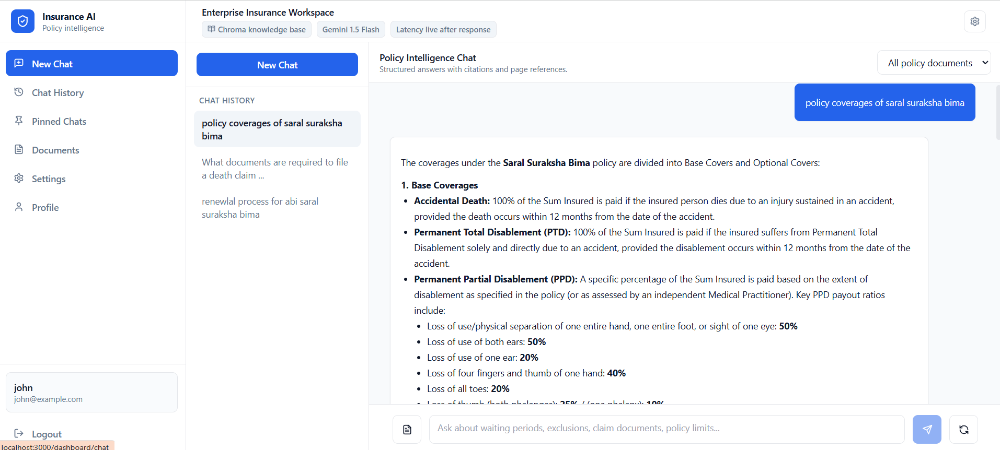
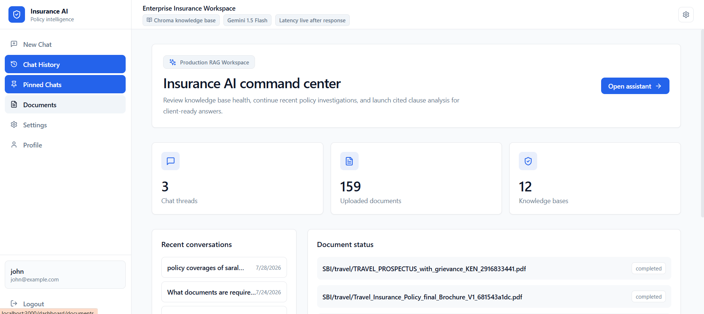
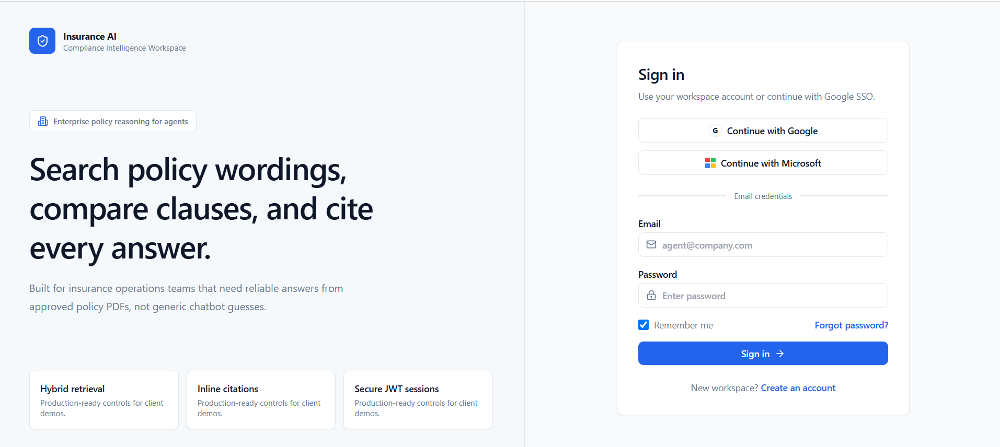

# InsuranceChatbot
# 🛡️ Insurance AI: Enterprise Policy RAG Command Center

An enterprise-grade, layout-aware RAG (Retrieval-Augmented Generation) chatbot workspace built to parse, search, and analyze complex insurance policy wordings, exclusions, and coverage documents. It delivers reliable, cited answers with page numbers, preventing LLM hallucinations.

---

## 📸 Screenshots & Interface

*Here you can replace these placeholders with screenshots of your running application:*

#### 💬 Chat Interface (Cited Answers & Source Viewer)


#### 🗄️ Document Vault (Upload & Ingestion Pipeline)


#### 🔐  Sign-In Page


---

## ✨ Features

### 1. 📂 Layout-Aware PDF Ingestion Pipeline
- **Recursive Directory Crawler**: Automatically walks through nested directories (e.g., `docs/HealthInsurance/`, `docs/lifeInsurance/`) at any depth level.
- **Dynamic Path-Based Metadata**: Resolves the Line of Business (LOB) and Carrier name dynamically from the subdirectory path structure.
- **Hierarchical Parent-Child Chunking**: Chunks text at two levels—extracts larger logical parent chunks (headings, sections) to feed rich context to the LLM, and splits them into smaller child chunks (350 tokens) to guarantee highly precise vector embeddings search.
- **Robust Local Parser Fallback**: Features a graceful exception catcher. If Google Gemini API credentials or connection limits fail, the system automatically redirects documents to a local text parser (`pypdf`), ensuring ingestion never crashes.

### 2. 🔍 Advanced RAG Search Engine
- **Hybrid Retrieval**: Integrates lexical search (BM25 keyword matching) and dense vector search (ChromaDB vector store) to capture both exact terminology and semantic intent.
- **Dynamic Context Budgeting**: Restricts the retrieved context to `3,500` tokens using a priority-reranking score, preventing the "lost-in-the-middle" context window degradation.
- **Offline Generation Toggle**: Supports running retrieval-only summaries in offline mode, bypassing LLM API costs when keys are missing.

### 3. 🔐 Enterprise Authentication & Access Controls
- **JWT Session Security**: Secure authorization using access tokens (in-memory) and HTTP-only rotation refresh tokens.
- **OAuth Single Sign-On (SSO)**: Pluggable routes for Google and Microsoft SSO logins.
- **Role-Based Access Control (RBAC)**: Enforces page routing limits (e.g., only Admin accounts can access the Document Vault).

---

## 🛠️ Project Structure

```
InsuranceChatbot/
├── docs/                        # Nested PDF Knowledge Base
│   ├── HealthInsurance/         # LOB folder (automatically mapped to metadata)
│   ├── lifeInsurance/
│   ├── motorInsurance/
│   ├── regulations/
│   └── travel/
├── backend/                     # FastAPI Backend Server
│   ├── app/
│   │   ├── api/                 # Endpoint routers (Auth, Chat, Documents)
│   │   ├── core/                # Config, Security, DB session
│   │   ├── models/              # SQLAlchemy database schemas
│   │   ├── rag/                 # RAG retrieval, chunking, providers
│   │   ├── schemas/             # Pydantic data schemas
│   │   ├── scripts/             # run_ingest.py (recursive ingestion script)
│   │   └── services/            # Ingestion, auth, storage services
│   ├── chroma_db/               # Chroma vector store persistence directory
│   ├── local_dev.db             # Local SQLite database
│   └── requirements.txt         # Python package dependencies
└── frontend/                    # Next.js React UI Workspace
    ├── src/
    │   ├── app/                 # App Router pages (chat, dashboard, documents, login)
    │   ├── components/          # Reusable UI parts (AuthGuard, MessageBubble)
    │   ├── hooks/               # useAuth session hook
    │   └── lib/                 # api.ts axios client config
    ├── .env.local               # Frontend environment variables
    └── package.json             # Next.js scripts and packages
```

---

## 🚀 Quickstart Guide

### 📋 Prerequisites
- **Python**: `3.10` or `3.11`
- **Node.js**: `18+` & `npm`

---

### 1. ⚙️ Backend Setup

Navigate to the `backend/` directory:
```bash
cd backend
```

Create and activate a virtual environment:
```bash
# Windows
python -m venv venv
venv\Scripts\activate

# macOS/Linux
python3 -m venv venv
source venv/bin/activate
```

Install dependencies:
```bash
pip install -r requirements.txt
```

Create a `.env` configuration file (you can copy `.env.example`):
```ini
ENV=development
SECRET_KEY=your_super_secret_session_key
DATABASE_URL=sqlite:///./local_dev.db
GOOGLE_CLIENT_ID=your_google_id
MICROSOFT_CLIENT_ID=your_microsoft_id
GEMINI_API_KEY=your_gemini_api_key
```

---

### 2. ⚡ Rebuilding the Knowledge Base
To wipe old test embeddings and run a clean, recursive ingestion over your structured `docs/` folder:

1. **Delete the old databases**:
   - Delete `backend/local_dev.db`
   - Delete all files inside `backend/chroma_db/`

2. **Run the Ingestion Script**:
   ```bash
   python app/scripts/run_ingest.py
   ```
   *The script will parse all PDFs recursively, create category schemas dynamically, and save embeddings in ChromaDB.*

3. **Verify Retriever**:
   ```bash
   python app/rag/evaluation/offline_evaluator.py
   ```

---

### 3. 🖥️ Frontend Setup

Navigate to the `frontend/` directory:
```bash
cd ../frontend
```

Install packages:
```bash
npm install
```

Verify your `.env.local` contains the correct Backend API URL:
```ini
NEXT_PUBLIC_API_URL=http://127.0.0.1:8000
```

Start the development server:
```bash
npm run dev
```

---

### 4. 🔗 Running the System

1. Start your backend FastAPI server:
   ```bash
   # inside /backend
   venv\Scripts\python -m uvicorn app.main:app --host 127.0.0.1 --port 8000 --reload
   ```
2. Start your frontend Next.js server:
   ```bash
   # inside /frontend
   npm run dev
   ```
3. Open your browser to **`http://localhost:3000`** and log in with your email credentials!

---

## 🔍 Ingestion & RAG Generation Flow

```
[ PDF Directory ] 
      │ (Recursive os.walk)
      ▼
[ Parent-Child Chunking ] ──► [ Local Fallback OCR ]
      │ (BM25 Lexical + Chroma Vector Embedding)
      ▼
[ Hybrid Retriever ]
      │ (Context Token Gate - 3,500 limit)
      ▼
[ Reranker & Biasing ]
      │ (Grounding Verification)
      ▼
[ cited Response ] ──► (No inline references in client answer UI)
```
